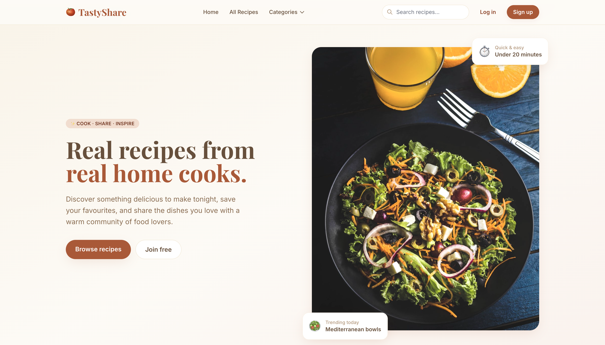
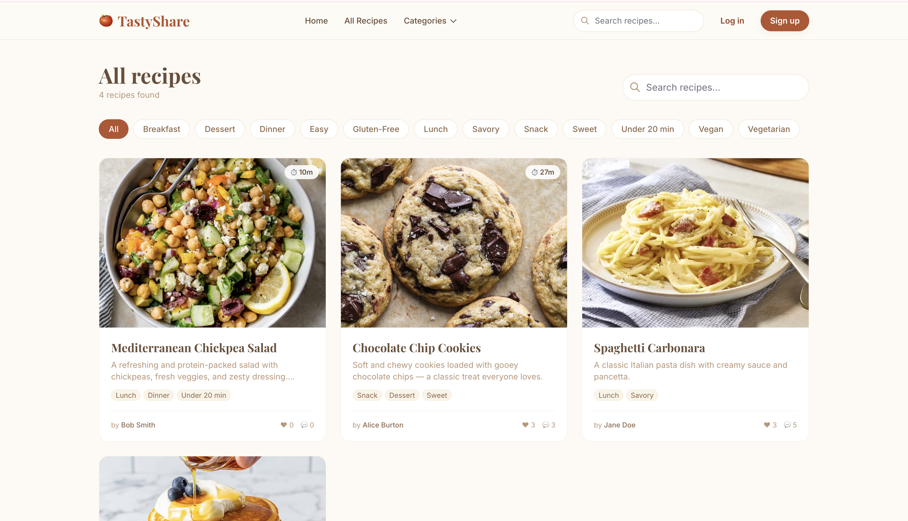
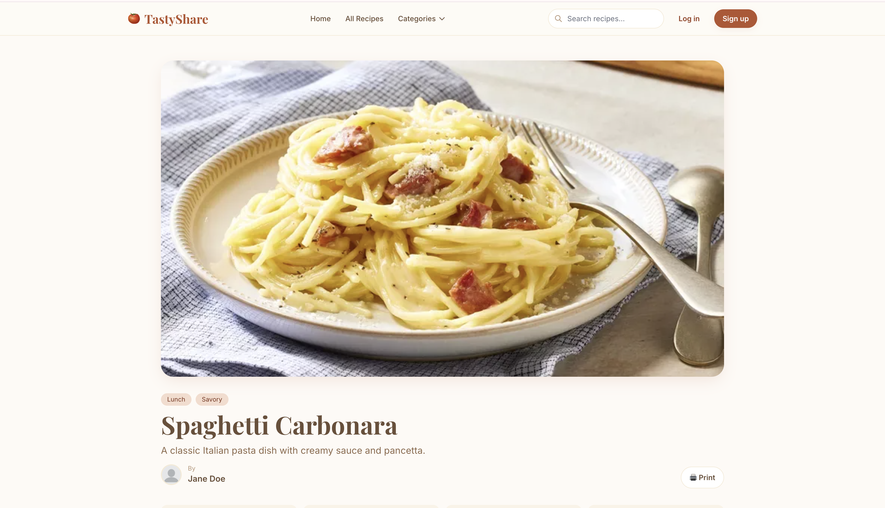
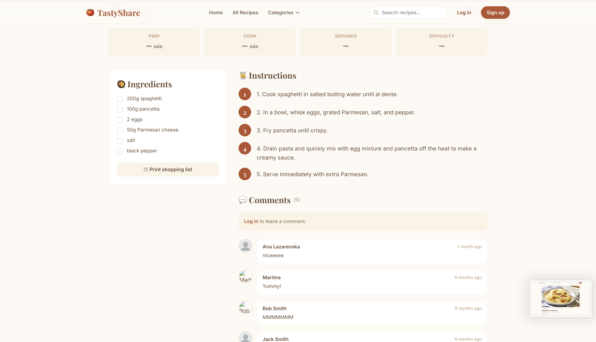
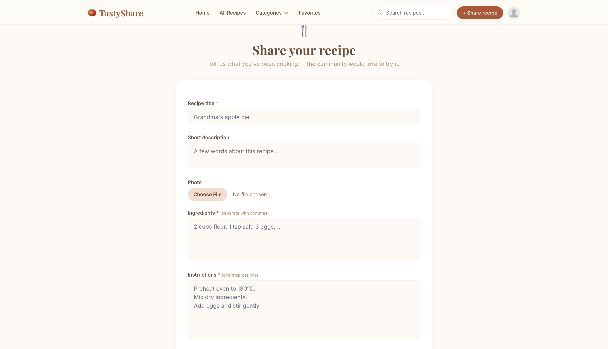

# 🍅 TastyShare

A community-driven recipe sharing platform built with **Laravel 11**, **Tailwind CSS**, and **Alpine.js**. Users can share their own recipes, browse and search what others have made, save favourites, leave comments, and print recipes (with a shopping list mode).

> Built as a personal project to practise full-stack development with Laravel — auth, file uploads, many-to-many relationships, search, authorization, and a polished UI.

---

## ✨ Features

- 🔐 **Authentication** — register, log in, edit profile, upload avatar, set bio & location
- 🍳 **Recipe management** — create, **edit**, and **delete** your own recipes (with proper authorization)
- 🖼️ **Image uploads** — every recipe can have a cover photo, with live preview before submitting
- 🏷️ **Tagging system** — many-to-many tags (Breakfast, Dinner, Vegan, Easy, …)
- 🔍 **Search** — search recipes by title, description, or ingredients
- 📑 **Filters & pagination** — filter by tag/category, browse 9 recipes per page
- ❤️ **Likes & favourites** — save recipes you love and like ones you appreciate
- 💬 **Comments** — leave comments on any recipe; authors can delete their own
- 👤 **Public user profiles** — view any user's recipes and stats (recipes posted, likes received, saves)
- 🖨️ **Print mode** — print a clean version of any recipe, or just the shopping list
- 📱 **Responsive** — works on phones, tablets, and desktops
- 🎨 **Warm modern UI** — cream / terracotta / clay palette with Playfair Display + Inter fonts

---

## 🛠️ Tech stack

| Layer | Technology |
|---|---|
| Backend | PHP 8.2+, Laravel 11 |
| Frontend | Blade, Tailwind CSS 3, Alpine.js |
| Build tool | Vite |
| Database | SQLite (dev) / MySQL or PostgreSQL (prod) |
| Auth | Laravel Breeze |

---

## 📸 Screenshots

### Home Page


### All Recipes


### Single Recipe



### Create Recipe


---

## 🚀 Getting started

### Requirements
- PHP **8.2+** with extensions: `mbstring`, `xml`, `pdo`, `sqlite3` (or `mysql`)
- **Composer** 2.x
- **Node.js** 18+ and **npm**

### 1. Clone the repo
```bash
git clone https://github.com/<your-username>/tastyshare.git
cd tastyshare
```

### 2. Install dependencies
```bash
composer install
npm install
```

### 3. Set up environment
```bash
cp .env.example .env
php artisan key:generate
```

### 4. Set up the database
By default, the project uses SQLite — easiest for local dev:
```bash
touch database/database.sqlite
```

Make sure your `.env` has:
```env
DB_CONNECTION=sqlite
DB_DATABASE=/absolute/path/to/database/database.sqlite
```

> Or for MySQL, set `DB_CONNECTION=mysql` and the rest of the credentials.

### 5. Run migrations & seed tags
```bash
php artisan migrate
php artisan db:seed --class=TagSeeder
```

### 6. Link the storage folder (so uploaded images show up)
```bash
php artisan storage:link
```

### 7. Build assets and start the server
In two separate terminals:
```bash
# Terminal 1 — Vite dev server (compiles CSS/JS)
npm run dev

# Terminal 2 — Laravel server
php artisan serve
```

Visit **http://127.0.0.1:8000** 🎉

### For production builds
```bash
npm run build
```

---

## 🗂️ Project structure

```
app/
 ├── Http/Controllers/
 │   ├── PostController.php          # Recipe CRUD, search, like, favourite, print
 │   ├── UserProfileController.php   # Public user pages
 │   ├── CommentController.php
 │   ├── DashboardController.php
 │   ├── HomeController.php
 │   └── ProfileController.php
 └── Models/
     ├── Post.php                    # Recipes (with slug, search scope, total_time)
     ├── User.php
     ├── Tag.php
     └── Comment.php

database/
 ├── migrations/                     # Database schema
 └── seeders/
     └── TagSeeder.php                # Seeds default tags

resources/views/
 ├── home/index.blade.php             # Landing page
 ├── posts/
 │   ├── all-posts.blade.php          # Recipes grid + search + filters
 │   ├── one-post.blade.php           # Single recipe page
 │   ├── create.blade.php             # Create recipe form
 │   ├── edit.blade.php               # Edit recipe form
 │   ├── favorites.blade.php          # User's saved recipes
 │   ├── print.blade.php              # Print-friendly view
 │   └── partials/
 │       ├── form.blade.php           # Shared form (DRY between create & edit)
 │       └── card.blade.php           # Reusable recipe card
 ├── users/show.blade.php             # Public user profile
 ├── dashboard.blade.php
 ├── auth/                            # Login, register, password reset…
 └── layouts/
     ├── main.blade.php               # Main layout w/ nav + footer + flash messages
     └── guest.blade.php              # Auth pages layout

routes/
 ├── web.php                          # Public + authenticated routes
 └── auth.php                         # Auth scaffolding routes
```

---

## 🔑 Routes overview

| Method | URL | Auth? | Purpose |
|---|---|---|---|
| GET | `/` | No | Home page |
| GET | `/posts` | No | All recipes (with `?q=` search and `?tag=` filter) |
| GET | `/posts/{post}` | No | Single recipe |
| GET | `/posts/{post}/print` | No | Print-friendly recipe (`?list=1` for shopping list mode) |
| GET | `/users/{user}` | No | Public user profile |
| GET | `/create` | Yes | Create recipe form |
| POST | `/posts/store` | Yes | Save new recipe |
| GET | `/posts/{post}/edit` | Yes (owner) | Edit form |
| PUT | `/posts/{post}` | Yes (owner) | Update recipe |
| DELETE | `/posts/{post}` | Yes (owner) | Delete recipe |
| POST | `/like/{post}` | Yes | Toggle like |
| POST | `/favorites/{post}` | Yes | Toggle favourite |
| GET | `/favorites` | Yes | My saved recipes |
| POST | `/comment/{post}` | Yes | Add comment |
| DELETE | `/comment/{comment}` | Yes (owner) | Delete comment |
| GET | `/dashboard` | Yes | My dashboard |
| GET | `/profile` | Yes | Edit my profile |

---

## 📊 Database schema

```
users         (1) ──< (M) posts
posts         (M) >──< (M) tags          via post_tag pivot
posts         (1) ──< (M) comments
posts         (M) >──< (M) users         via like_post pivot     (likes)
posts         (M) >──< (M) users         via favorite_post pivot (favourites)
```

---

## 🧠 What I learned building this

- Eloquent relationships, especially many-to-many with pivot tables
- Eager loading with `with()` and `withCount()` to avoid N+1 queries
- Authorization patterns (manual ownership checks via `abort_unless`)
- File uploads, storage linking, cleaning up old files on update/delete
- Form validation, flash messages, and good error UX
- Building a coherent design system with Tailwind (custom palette, fonts, shadows)
- Alpine.js for small interactive bits (dropdowns, mobile menu) without React overhead

## 🚧 Possible future improvements

- [ ] Recipe ratings (1–5 stars)
- [ ] Recipe collections / cookbooks
- [ ] Email notifications when someone comments on your recipe
- [ ] Convert ingredient quantities (metric ↔ imperial)
- [ ] Servings calculator (auto-scale ingredient amounts)
- [ ] Recipe API (so a mobile app could consume it)
- [ ] Image optimization & multiple sizes (currently raw uploads)

---

## 📄 License

Open source — feel free to learn from it.

## 👩‍💻 Author

Built by **Ana Lazarevska** as a learning project.
[LinkedIn](https://linkedin.com/in/ana-lazarevska-591522368) · ana.lazarevska19@gmail.com
